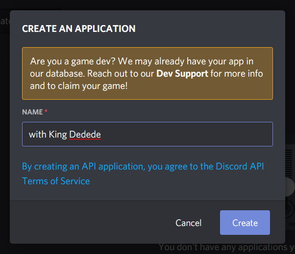

# [ezpzrpc](https://kirbyyourmom.github.io/ezpzrpc/)

ezpzrpc is a way to display a custom rich presence in discord, easily.

### Setup instructions:

- Start off by install [node.js](https://nodejs.org/)
- Once done, open up your terminal and try running `node` or `npm`. If you get an output, you're set! If you don't, you have to add node to your path. To do that, follow [this answer](https://stackoverflow.com/a/27864253).
- Now, you can go ahead and clone this repo and extract it to a folder.
- Open a terminal and cd into it by doing `cd path/to/folder/`. Then, run the following: `npm install`. This will resolve and install all the dependencies for you.
- Next, compile the typescript source files to javascript by this command in the terminal: `npx tsc`
- Once compiled, run the node application by entering the following command in the terminal: `npm start`.
- If you get a message in blue, it means you're all good! Otherwise, you might have to check what the error says and do what's necessary.

### Setting up an application:

This is needed if you want to make custom presences with different name, and images. So, how do we make one?

- Head over to the [discord developer portal](https://discord.com/developers/applications)
- Now to create a new application, press this button:

  

- You should see a pop up with a text field for the name of the application.

  
  <br />

  This name, will appear in your status if you have that enabled.

  

- Once that's done, you should see a screen titled "General Information" and a subtitle called "Application ID". You will have to copy that.

  

- Next, go to the Rich Presence tab and the "Art Assets" sub tab.

  

- Add an image. This is needed if you want an image in your rich presence. To do this, press the 'Add image(s)' button.

  

  and select an image from your computer files. Once done, you can name it anything you like, but make sure you remember the name as it is needed when configuring ezpzrpc.

  

That's all!

### Configuring ezpzrpc:

This is the final step. This is important if you want to customise the RP.

- Open the 'config.txt' file. Do **NOT** mess with the 'config.ts' and or 'config.js' file.
- You should see something like this:

```
clientId: 839514540635193354
details: King Dedede
state: King Dedede
smallImage: small
smallImageText: King Dedede
largeImage: small
largeImageText: King Dedede
button1Text: Button 1
button1Url: https://google.com
button2Text: Button 2
button2Url: https://google.com
```

- This is the boilerplate. You **NEED** `clientId` or else the program will error and exit. You can change everything after the colon.

- What do the fields mean?

  You can understand what they mean by this picture:

  

<br />

**That's all! Enjoy!**
